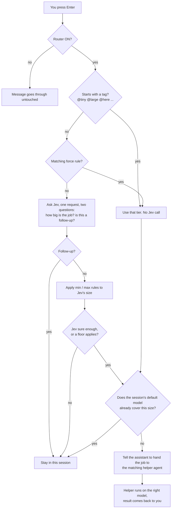
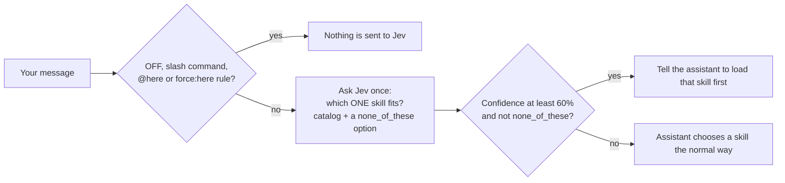

# jev-agent-toolkit

**Put a fast, cheap decision-maker in front of your AI coding assistant.** This toolkit plugs
[Jev](https://docs.typesafe.ai/) (TypeSafe's "System One" decision model, reached through OpenRouter) into
**Claude Code** and the **OpenAI Codex CLI** so that, for every message you type:

- the **right-sized model** does the work: small jobs go to a small, cheap model, big jobs go to a strong one;
- the **right skill** gets loaded, even when you have a hundred of them;
- **you stay in control** with one-word overrides (`@large`, `@here`) and standing rules
  ("anything that touches DNS never runs on the cheapest model");
- and **nothing slows you down or breaks**: if anything at all goes wrong, your message goes through exactly
  as if the toolkit were not installed.


```text
you>  @large review the migration plan in docs/plan.md
      Jev (model): you asked for a large job (@large) → sent to the Opus 5.5 helper

you>  Create a DNS A record for app.example.com pointing to 1.2.3.4
      Jev (model): rule 'infra/money/destructive: never the cheapest model' raised this to
                   an everyday job (Jev guessed a tiny job, 70%) → answered here (Sonnet 5 covers it)

you>  Make a 10-slide deck pitching our hosting to small businesses
      Jev (skill): picked `pptx` (97% sure) → loading it
```

> **Not affiliated.** This is an independent, community project. It is not made or endorsed by TypeSafe,
> OpenRouter, Anthropic or OpenAI. See [Disclaimer](#disclaimer).

---

## Table of contents

1. [What is this?](#1-what-is-this)
2. [Why you might want it](#2-why-you-might-want-it)
3. [At a glance](#3-at-a-glance)
4. [How it works](#4-how-it-works)
5. [Requirements](#5-requirements)
6. [Quick start](#6-quick-start)
7. [Keep your key safe (no secrets in files)](#7-keep-your-key-safe-no-secrets-in-files)
8. [Using it day to day](#8-using-it-day-to-day)
9. [Configuration reference](#9-configuration-reference)
10. [Use cases](#10-use-cases)
11. [Model lineups and adapting to yours](#11-model-lineups-and-adapting-to-yours)
12. [The `jev` skill: batch decisions over piles of text](#12-the-jev-skill-batch-decisions-over-piles-of-text)
13. [Benefits, and what this does *not* do](#13-benefits-and-what-this-does-not-do)
14. [Measured results](#14-measured-results)
15. [Privacy and security](#15-privacy-and-security)
16. [Several machines](#16-several-machines)
17. [Troubleshooting](#17-troubleshooting)
18. [Uninstall](#18-uninstall)
19. [Repository layout](#19-repository-layout)
20. [Development](#20-development)
21. [FAQ](#21-faq)
22. [Credits, disclaimer, license](#22-credits-disclaimer-license)

Deeper guides live in [`docs/`](docs): [how it works](docs/HOW_IT_WORKS.md),
[key management](docs/KEY_MANAGEMENT.md), [customising](docs/CUSTOMIZING.md),
[troubleshooting](docs/TROUBLESHOOTING.md) and [the evidence](docs/EVIDENCE.md).

---

## 1. What is this?

**Jev** is a different kind of AI model. It does not write text. You hand it some text plus a few typed
questions, and it answers almost instantly with structured results your code can use directly:

| Question type | You ask | Jev returns |
|---|---|---|
| **choice** | "Which one of these options fits?" | the chosen option, a probability per option, a confidence |
| **score** | "How strong is this, on this scale?" | a score, a probability per level, a confidence |
| **noul** | "Is this statement true?" | the probability that it is |

That makes it a superb *sorter and decider*: fast (typically 0.3 to 0.9 seconds in our tests) and very cheap
(a small fraction of a cent per call), and it is **not** a chat model, so it cannot replace Claude or Codex.

This toolkit uses that ability at the two places where an AI coding assistant makes small decisions all day:

1. **Which model should handle this message?** (the *model router*)
2. **Which skill (saved instruction set) should handle this message?** (the *skill picker*)

Both are implemented as `UserPromptSubmit` **hooks**: small scripts that Claude Code and Codex run for you
before each message is processed. The hook asks Jev, then hands the assistant a one-line instruction such as
"delegate this to the `jev-large` helper" or "load the `pptx` skill first". **Jev only points; the assistant
does all of the writing and the work.**

The repository also ships an optional **`jev` skill** so you can say "use Jev to sort these 200 support
emails" and have the assistant do it in one cheap batch.

## 2. Why you might want it

| Problem | What this gives you |
|---|---|
| You run one strong (expensive) model for everything, including one-line questions | Tiny jobs are sent to the smallest model; big jobs to the strongest; the rest stay on your everyday default |
| You *want* a cheaper default but hate it failing on hard problems | Set a mid-tier default and let the router **escalate** only when a job needs more |
| You have dozens of skills and the wrong one sometimes loads (or none does) | Jev reads the whole skill list at once and points at the right one, with a confidence you can see |
| Automatic routing sometimes gets the stakes wrong ("just a DNS record" is not really tiny) | **Rules** set floors and caps by keyword, and **tags** override on the spot |
| You worry about prompts leaving your machine | It is **OFF until you switch it on**, a single `@here` keeps any message out of Jev, logs never contain your text, and the key is never stored in a file |
| You use both Claude Code and Codex, on several machines | One design, one installer, one set of habits for both tools |

It is deliberately conservative: a router that can break your session is worse than no router. See
[fail-open by design](#fail-open-by-design).

## 3. At a glance

| | Claude Code | Codex CLI |
|---|---|---|
| Model router (size each message, delegate when needed) | yes | yes |
| Skill picker (one skill out of your whole list) | yes (~140 skills tested) | yes (~80 tested) |
| Tags (`@tiny` … `@here`) and rules (`min` / `max` / `force`) | yes | yes |
| Helper agents, one per size | `~/.claude/agents/jev-*.md` | `~/.codex/agents/jev-*.toml` |
| Hook config it edits | `~/.claude/settings.json` | `~/.codex/hooks.json` |
| Default model it reads (the "baseline") | `model` in `settings.json` | `model` in `config.toml` |
| CLI | `jev-router`, `skill-pick` | `cx-router`, `cx-skill-pick` |
| `jev` skill for batch decisions | yes | not shipped |
| Tested versions | Claude Code 2.1.x | Codex CLI 0.155.0 and 0.157.1 |

## 4. How it works



A second, independent hook does the skill choice:



Things worth understanding:

- **A hook cannot switch your main model.** Your session model is fixed before your message reaches the
  hook. What a hook *can* do is give the assistant an instruction, so the router delegates work to **helper
  agents** (Claude Code subagents / Codex subagents), each pinned to one model.
- **It is baseline-aware.** The router reads your default model live (`model` in Claude Code's
  `settings.json`, or in Codex's `config.toml`). A job goes to a helper only if it needs a *bigger* model than
  the one you are already on. Change your default with `/model` and the router adapts by itself.
- **Tiny jobs are the exception.** By design they always go to the smallest model, even if your default is
  stronger, unless your default *is* the smallest. (Read [the trade-off](#the-tiny-jobs-trade-off) before you
  keep this.)
- **Follow-ups stay put.** "yes, do that but shorter" only makes sense inside the conversation, so it is
  never delegated: the helper would not have the context.
- **Everything fails open.** See below.

### Fail-open by design

Every hook exits successfully and prints nothing on any problem: a missing key, no network, Jev timing out
(the default is 1.5 s), a rate limit, a garbled reply, a typo in your rules file, a bug. In each case your
message simply goes through as if the toolkit were not there. There are tests for these cases.

## 5. Requirements

- **macOS or Linux** (Windows is untested).
- **Python 3.8+** (no third-party packages: standard library only) and `bash` for the installer.
- **Claude Code** and/or the **Codex CLI**, with hooks enabled (both support `UserPromptSubmit` hooks;
  Codex has them as a stable feature: check `codex features list`).
- An **[OpenRouter](https://openrouter.ai/keys) API key** with a little credit. Jev costs about $0.042 per
  million input tokens (output is free), so a few dollars lasts a very long time.

## 6. Quick start

```bash
git clone https://github.com/panosru/jev-agent-toolkit.git
cd jev-agent-toolkit

# 1. Install. Add --key-cmd so the tools can find your key (see section 7). Nothing is switched on yet.
./install.sh --all --key-cmd 'security find-generic-password -s jev-openrouter -w'   # macOS Keychain example

# 2. Check the whole chain, including one real (fraction-of-a-cent) Jev call. The key is never displayed.
jev-router doctor

# 3. Try a message without sending anything to Jev: shows what a tag or rule would do
jev-router check "@haiku what time is it in Tokyo"

# 4. Turn it on when you are ready
jev-router on && skill-pick on          # Claude Code
cx-router on  && cx-skill-pick on       # Codex
```

What the installer does (and only this):

- copies the scripts, the four helper agents, and (for Claude Code) the optional `jev` skill into `~/.claude`
  and/or `~/.codex`;
- **merges** two hooks into `settings.json` / `hooks.json` (your existing hooks and settings are kept, the
  file is backed up first as `*.bak-jev-<timestamp>`, and re-running it is a no-op);
- builds the skill catalog, creates short commands in `~/.local/bin`, and leaves everything **OFF**.

Useful flags: `--claude`, `--codex`, `--all`, `--enable` (switch on immediately), `--dry-run` (change
nothing, print the plan), `--no-symlinks`, `--no-skill`, `--uninstall`. Run `./install.sh --help`.

Already-running sessions usually pick up new hooks automatically; if yours does not, run `/hooks` (or restart).
In Codex, hooks you did not write yourself must be reviewed once (`/hooks`) before they run.

## 7. Keep your key safe (no secrets in files)

**This project never stores your API key**, and nothing in this repository contains one. The scripts find it
at call time, in this order:

| Order | Source | Notes |
|---|---|---|
| 1 | `OPENROUTER_API_KEY` environment variable | simplest; the tool has to be launched from a shell that has it |
| 2 | `JEV_KEY_CMD` environment variable | a **command** that prints the key |
| 3 | The command saved in `~/.config/jev/key_cmd` | a **command**, not the key: safe on disk, and it works for sessions launched from a GUI, which inherit no shell environment. `./install.sh --key-cmd '...'` writes it (mode 600) |

The key command is split like a shell would split it (`shlex`) but **run without a shell**: pipes,
redirects and `;` are *not* interpreted. If you need a pipeline, put it in a small script and point the
command at the script. `~` and `$VARS` are expanded per argument.

Recipes (details and caveats in [docs/KEY_MANAGEMENT.md](docs/KEY_MANAGEMENT.md)):

```bash
# macOS Keychain: add an item named jev-openrouter (Keychain Access app -> New Password Item is the safest way,
# because a key typed into a command line ends up in your shell history), then point the installer at it.
# We did not test the Keychain recipe ourselves, so try it once with a dummy value.
./install.sh --key-cmd 'security find-generic-password -s jev-openrouter -w'

# Linux (libsecret)
secret-tool store --label='Jev OpenRouter' service jev-openrouter
./install.sh --key-cmd 'secret-tool lookup service jev-openrouter'

# pass
pass insert openrouter/key
./install.sh --key-cmd 'pass show openrouter/key'

# sops / age, 1Password CLI, Bitwarden, a cloud secret manager, ...: anything that can print the key
./install.sh --key-cmd '/path/to/your-key-script'
```

Rules of thumb: never put the key in `settings.json`, `hooks.json`, a `.env` you might commit, your shell
history, or a screenshot. `JEV_KEY_CMD` holds a *command*, which is not sensitive. If a key ever leaks,
revoke it at <https://openrouter.ai/keys> and update your key store: nothing in this project changes.

## 8. Using it day to day

### What you will see

Each message may show one or two short status lines before the assistant replies:

```text
Jev (model): a tiny job (100% sure) → sent to the Haiku 4.5 helper
Jev (model): an everyday job (99% sure), already covered by Sonnet 5 → answered here
Jev (model): looks like a follow-up to our conversation (96% sure) → answered here as usual
Jev (model): not sure how big this is (best guess: a large job, 54%) → answered here as usual
Jev (skill): picked `xlsx` (97% sure) → loading it
Jev (skill): no skill fits this (98% sure) → answering directly
Jev (skill): not sure which skill fits (best guess: `simplify`, 40%) → picking the normal way
```

Percentages are Jev's confidence in *that* answer. Below 60% Jev is treated as "not sure" and your session
handles the message as usual.

### Tags: steer a single message

Start a message with a tag. It beats every rule, skips Jev entirely (so it is instant and free, and works
offline), and is honoured literally.

| Tag | Meaning |
|---|---|
| `@tiny` `@everyday` `@large` `@hardest` | force that tier (`[large]` also works) |
| `@here` | keep this message in the current session and **do not send it to Jev at all** (router *and* skill picker) |
| Claude Code: `@haiku` `@sonnet` `@opus` `@fable` | same tiers, by model name |
| Codex: `@luna` `@sol` `@astra` `@ultra` | same tiers, by model name (`@ultra` = hardest) |

Only a tag at the **very start** counts: `@src/main.py`, `bob@example.com`, `[WIP]` and a mid-sentence
`@tiny` are ordinary text. If `@` triggers your terminal's file-mention popup, use the bracket form, for
example `[large] refactor this`. Tags do nothing while the router is OFF.

An explicit tag is taken literally, even downwards: `@everyday` while your default is a bigger model sends the
job to the everyday helper.

### Rules: standing preferences

`rules.json` (next to the router: `~/.claude/jev-router/` or `~/.codex/jev-router/`) holds rules of the form
`match` (a case-insensitive regex) plus one or more of:

| Field | Effect |
|---|---|
| `force: "tiny" \| "everyday" \| "large" \| "hardest" \| "here"` | skip Jev and use this tier (`here` = stay here **and** never send the message to Jev) |
| `min: "…"` | never go *below* this tier. A floor is a promise, so it applies even when Jev is unsure |
| `max: "…"` | never go *above* this tier (applied only when Jev is sure) |
| `note` | the label shown in the status line |

The shipped default rule is a floor:

```json
{ "match": "cloudflare|\\bdns\\b|\\bdomains?\\b|nameserver|registrar|\\bdeploy(ing|ment|ed)?\\b|\\binvoices?\\b|\\bdelet(e|ing|ed)\\b",
  "min": "everyday", "note": "infra/money/destructive: never the cheapest model" }
```

Precedence: **tag → `force` rule → Jev's size with `min`/`max` on top.** Follow-up detection runs before
rules, so a rule never drags "yes, do it" out of the conversation. Bad rules are skipped silently, so a typo
cannot break a message. More recipes in [docs/CUSTOMIZING.md](docs/CUSTOMIZING.md).

### The commands

```bash
jev-router on | off          # switch the router (cx-router for Codex)
jev-router status            # what it decided so far, what it cost, which overrides fired
jev-router rules             # list your rules and tags
jev-router check "message"   # offline dry run of tags and rules; never calls Jev
jev-router doctor            # hook registered? agents present? key found? one live call works?

skill-pick on | off | status # cx-skill-pick for Codex
skill-pick "some request"    # try the picker on any request without loading anything
skill-pick --list            # the catalog Jev sees: every skill, one line each
skill-pick --rebuild         # rebuild after you add or remove skills
```

Example `status` (illustrative numbers):

```text
Jev router (Claude Code): ON   session default model: Sonnet 5
Tiny jobs always go to the smallest model; other sizes go to a helper only when they need a
bigger model than your session default.
Messages seen: 42  (since 2026-09-27T09:31:43)
Sent to a helper:
  tiny      6
  everyday  0
  large     3
  hardest   1
Kept by the main session: 20 already your size, 4 Jev unsure, 8 follow-up replies
Overrides used: 3x tag, 2x rule-min
Jev time: avg 529 ms, max 687 ms
Jev cost so far: $0.000917
```

### Improving the skill picker

Jev chooses by reading **one line per skill**, so a wrong pick almost always means a vague line. Copy
`overrides.example.json` to `overrides.json` in the picker's folder, write a sharper line, and run
`skill-pick --rebuild`. In our testing, rewriting five one-liners lifted two shaky picks (66% and 78%) to
98% and 96%. `exclude` removes skills you never want picked.

## 9. Configuration reference

### Environment variables

Everything has a sensible default. All are optional and can be set in your shell profile or, for
GUI-launched sessions, in the tool's own `env` setting (for non-secrets only).

| Variable | Default | What it does |
|---|---|---|
| `OPENROUTER_API_KEY` | none | your key (see [section 7](#7-keep-your-key-safe-no-secrets-in-files)) |
| `JEV_KEY_CMD` | none | command that prints the key |
| `JEV_CONFIG_DIR` | `~/.config/jev` | where `key_cmd` is read from |
| `JEV_KEY_CMD_TIMEOUT` | `2.0` | seconds the key command may take (5 for the `jev` skill) |
| `JEV_ENDPOINT` | `https://openrouter.ai/api/alpha/decisions` | the Decisions route (it is an *alpha* route: override it if it moves) |
| `JEV_MODEL` | `typesafe/jev-1.13` | the Jev model name on OpenRouter |
| `JEV_HTTP_TIMEOUT` | `1.5` | seconds before a hook gives up on Jev (the installer registers the hooks with a 5 s ceiling) |
| `JEV_ROUTER_MIN_CONFIDENCE` | `0.60` | below this, the router leaves the message alone |
| `JEV_SKILL_MIN_CONFIDENCE` | `0.60` | below this, the picker leaves skill choice to the assistant |
| `JEV_FOLLOWUP_CUTOFF` | `0.50` | above this, a message counts as a follow-up |
| `JEV_ROUTER_RULES` | next to the router | alternative path to `rules.json` |
| `JEV_ROUTER_FORCE`, `SKILL_PICKER_FORCE` | unset | set to `1` to run a hook even while it is switched off (debugging) |
| `JEV_ROUTER_LOG`, `SKILL_PICKER_LOG` | next to the script | alternative log path (debugging) |

A malformed number falls back to the default instead of crashing the hook.

### Files

| Path | Purpose |
|---|---|
| `~/.claude/jev-router/{router.py, jev-router, rules.json, enabled, log.jsonl}` | Claude Code router, CLI, your rules, on/off flag, decision log |
| `~/.claude/skill-picker/{picker.py, builtins.json, overrides.json, catalog.json, enabled, log.jsonl}` | Claude Code skill picker and its state |
| `~/.claude/agents/jev-{tiny,everyday,large,hardest}.md` | helper agents (each pinned to a model) |
| `~/.claude/skills/jev/` | the optional batch-decision skill |
| `~/.codex/jev-router/…`, `~/.codex/skill-picker/…` | the same for Codex (`cx-router`) |
| `~/.codex/agents/jev-*.toml` | Codex subagent profiles (model plus reasoning effort) |
| `~/.config/jev/key_cmd` | optional: the command that prints your key |

The on/off state is just the presence of the `enabled` file, so it survives restarts.

## 10. Use cases

**1. A cheaper daily driver that still escalates.** Set your default to the mid-tier model (for example
Sonnet, or Codex's `gpt-6-sol`). Everyday work stays there; large and hardest jobs are handed to the strong
helpers automatically. You pay strong-model prices only for the messages that need them.

**2. Guard rails for risky work.** A one-line request can be high-stakes: "point the DNS record at the new
server", "delete the old invoices folder", "deploy to production". Jev sizes by *wording*, not by
consequence, so add a floor rule (the shipped default already does) and those messages never land on the
cheapest model.

**3. Large skill libraries.** With 100+ skills, descriptions get truncated in the assistant's own index and
similar skills blur together (`pptx` vs an HTML `slides` skill, for instance). The picker shows Jev the whole
catalog at once and returns a pick with a confidence. In our 10-request check it chose correctly every time
([details](docs/EVIDENCE.md)), and it says "none of these" instead of forcing a guess.

**4. Deterministic control when you want it.** Prefix `@large` for a hard problem, `@tiny` for a quick
lookup, `@here` for anything sensitive. No guessing, no cost, no network.

**5. Batch triage with Jev directly.** Sort 200 support emails by urgency and team, score inbound leads,
flag messages that need a personal reply: one request per item, run in parallel, roughly $0.03 per thousand
short items. The assistant does only the writing that follows. See [section 12](#12-the-jev-skill-batch-decisions-over-piles-of-text).

**6. Team or personal conventions.** Keep your `rules.json` in a dotfiles repo so every machine routes the
same way, or agree on rules as a team ("anything mentioning `prod` is at least everyday").

**7. Seeing where your messages go.** `jev-router status` shows how often each tier is used and what Jev
costs. The log holds sizes, scores and timings, never your text, so it is safe to look at and to share.

**8. Two assistants, one habit.** The same tags, the same rules format and the same status lines in Claude
Code and Codex.

## 11. Model lineups and adapting to yours

The router thinks in four **tiers**: `tiny`, `everyday`, `large`, `hardest`. Each tier has a helper agent
pinned to a model.

| Tier | Claude Code helper | Codex subagent |
|---|---|---|
| `tiny` | `jev-tiny` on **Haiku** | `jev-tiny` on **gpt-6-luna**, low effort |
| `everyday` | `jev-everyday` on **Sonnet** | `jev-everyday` on **gpt-6-sol**, medium effort |
| `large` | `jev-large` on **Opus** | `jev-large` on **gpt-6-astra**, high effort |
| `hardest` | `jev-hardest` on **Fable** | `jev-hardest` on **gpt-6-astra**, ultra effort |

Claude Code has four distinct models, so each tier is its own model. Codex (in the catalog we tested) has one
frontier model with adjustable reasoning effort plus two lighter ones, so `large` and `hardest` share a model
and differ in effort. Model names change over time: they are the names that were current when this was
written. To adapt the mapping to yours, edit the `SIZES` table at the top of `router.py` (tier name, helper
name, display name, a model-name fragment used to recognise your default model, and the description Jev sees)
and the `model` field of the four agent files. Have fewer models? Point two tiers at the same model. Full
walkthrough: [docs/CUSTOMIZING.md](docs/CUSTOMIZING.md).

**Recommended setup:** make your session default the *everyday* model (Sonnet / `gpt-6-sol`) and let the
router escalate. If your default is already your strongest model, only `hardest` (and `@tags`) ever
delegate, which is still useful but does much less.

## 12. The `jev` skill: batch decisions over piles of text

Installed with the Claude Code side. Just ask:

> *Use Jev to sort these 200 support emails by urgency and which team should handle them.*

The assistant builds the questions, runs them through `python3 ~/.claude/skills/jev/scripts/jev.py`
(one request per item, 8 in parallel), and reports a compact table with confidence, wall time and cost. The
skill's ground rules: **Jev decides, the assistant writes**; when Jev is unsure (`confidence < 0.75`, or a
yes/no probability between 0.2 and 0.8) the assistant makes the call itself and says so; and the assistant
**asks before sending anything private**, because whatever goes to Jev leaves your computer.

Try the caller yourself, with an invented email:

```bash
cat > request.json <<'EOF'
{
  "state": {"email": {"subject": "Pricing for 40 seats before Q4?",
                      "body": "We're replacing our dispatch tool, budget is approved, can we get a demo Tuesday?"}},
  "questions": {
    "lead_strength": {"type": "score", "instructions": "How strong a sales lead is the sender of `email`?",
      "criteria": ["Not a lead", "Weak lead", "Moderate lead: real need, missing budget or timeline",
                   "Strong lead: clear need, budget and near-term timeline"]},
    "needs_personal_reply": {"type": "noul", "instructions": "Does `email` need a personal reply from a person?",
      "criteria": {"true": "Asks specific questions or proposes meeting times", "false": "A template reply is fine"}}
  }
}
EOF
python3 ~/.claude/skills/jev/scripts/jev.py request.json    # prints answers plus latency and cost
```

## 13. Benefits, and what this does *not* do

### Benefits

- **Capability matching.** Strong models for hard jobs, small models for trivial ones, without you thinking
  about it on every message.
- **Skill accuracy.** The right skill on the first try, and an honest "none of these".
- **Control.** Tags for the moment, rules for the long run, `@here` for privacy.
- **Cost transparency.** A Jev decision costs about **$0.00002 to $0.0003** and takes **0.3 to 1 s**.
- **Safety.** Off by default, fails open, never stores a secret, logs no message text.
- **Portable.** Standard-library Python, one installer, works the same on macOS and Linux.

### What it does *not* do (please read)

- **It does not lower your bill by itself.** The biggest cost in a long session is usually the growing
  conversation being re-read on every turn, and routing does not touch that. The lever that does is your
  **default model**: pick a mid-tier default, then let the router escalate.
- **Escalation costs more, on purpose.** Sending a large job to a stronger helper spends more of your quota
  than answering it on the everyday model. You are paying for a better answer on the jobs that need one.
- **Helpers start from scratch.** A helper agent does not see your conversation. The assistant briefs it, but
  it is a cold start (see the trade-off below).
- **Jev sees only your message text**, not the files it will touch, the tools that are connected, or how risky
  the action is. That is why rules and tags exist.
- **It is not deterministic.** Identical wording can score 0.94 one moment and 0.58 the next. Treat the
  confidence as a signal, and use tags when you need certainty.
- **The OpenRouter route is an alpha API.** The endpoint or model name may change; both are configurable.
- **Prompt injection applies.** Text inside a message can steer Jev. Treat its answers as advisory, and use
  floors and `force` rules for anything that matters.
- **It cannot change the model your session runs on**, only hand work to helpers.

### The tiny-jobs trade-off

By default `tiny` jobs always go to the smallest model. That is what many people expect, but it can
backfire: a helper is a fresh session that loads its own system prompt and tool definitions. In our
measurement, one trivial question run through a standalone Haiku helper cost about **$0.05 at list prices**
(a standalone `claude -p` run, the closest proxy we had for a cold helper; a subagent inside a session may
differ), far more than answering it inside an already-warm conversation. If tiny jobs are most of your
traffic, watch `jev-router status`, and if it does not pay off for you, change one line in
`decide()` (`covered = base_rank == 0` for `tiny`) so tiny jobs stay local like everything else. See
[docs/CUSTOMIZING.md](docs/CUSTOMIZING.md#stop-tiny-jobs-from-always-delegating).

## 14. Measured results

Small, hand-made samples on real installs. **Illustrative, not a benchmark.** Method and raw tables:
[docs/EVIDENCE.md](docs/EVIDENCE.md).

| What | Result |
|---|---|
| Router call (2 questions, one request) | 0.35 to 0.76 s, about $0.000023 each |
| Skill picker call (140-skill catalog, one request) | 0.4 to 1.0 s, about $0.00026 each |
| Router sizing on 10 hand-written messages | all 8 sizes right, both follow-ups detected; one borderline "hardest" (58%) correctly fell back to "not sure" |
| Skill picker on 10 realistic requests | 10 of 10 correct (one of them "no skill needed"); after sharpening five one-liners, two shaky picks (66% and 78%) rose to 98% and 96% (a third moved from 97% to 88%, still correct) |
| Codex delegation, end to end | a forced `[tiny]` message produced `spawn_agent(agent_type="jev-tiny")`, and the subagent thread ran on `gpt-6-luna` |
| Batch mode (3 short emails, in parallel) | 0.86 s total, about $0.00005 |
| Test suite | 44 offline tests, run on Linux and macOS in CI |

For context, TypeSafe's own write-ups report [12.2x cheaper and 10x faster](https://docs.typesafe.ai/cookbooks/parallel_questions)
when many questions about one text go into a single Jev call, and a [skill-suggestion
recipe](https://docs.typesafe.ai/cookbooks/skill_suggestion) that cut wrong skill loads from 16.8% to 7.3% on a
182-skill roster (a different agent and roster, with a two-step design; this toolkit uses a simpler
single-call version).

## 15. Privacy and security

**What leaves your machine, while the tools are ON:**

- the **text of each message you type** (the router sends the first 6,000 characters, the picker the first
  4,000) to **OpenRouter**, which forwards it to **TypeSafe**, the company that makes Jev;
- the picker also sends the **one-line descriptions of your skills**;
- nothing else: no files, no conversation history, no tool output.

**What is stored locally:** decision logs with tier, confidence, latency and cost. **Never message text and
never the key** (both are covered by tests). Logs live next to the scripts, so delete them any time.

**How to keep something private:** start the message with `@here`, or add a `force: "here"` rule for
sensitive keywords (client names, "password", …). Either one keeps that message out of Jev entirely, for both
hooks. For a whole private project, `jev-router off && skill-pick off`.

**Defaults that protect you:** OFF after install; fail-open on every error; the key is resolved at call time,
held in memory only, and never printed; the key command runs without a shell; the installer backs up and
merges your config and never overwrites existing hooks; errors never include key material.

See [SECURITY.md](SECURITY.md) to report a vulnerability, and TypeSafe's and OpenRouter's own terms for how
they handle the data you send them.

## 16. Several machines

Clone the repo on each machine, run `./install.sh --all --key-cmd '...'` with a key command that suits that
machine (Keychain on a Mac, `pass` or `secret-tool` on Linux), and commit your `rules.json` to your dotfiles if
you want identical rules everywhere. Each machine reads its **own** default model, so a machine that defaults
to Opus and one that defaults to Sonnet each escalate correctly without any per-machine tuning. Two gotchas from
real use: non-interactive SSH sessions often lack `~/.local/bin` on `PATH` (call scripts by full path), and
some GUI-launched sessions inherit no shell environment (use the `key_cmd` file, not a shell export).

## 17. Troubleshooting

Start with `jev-router doctor`: it checks the hook, the helper agents, the rules, your default model, that a
key resolves, and that one live call works. The most common issues:

| Symptom | Likely cause and fix |
|---|---|
| Nothing appears after installing | It is OFF: run `jev-router on && skill-pick on`. Then `/hooks` or restart if the session predates the install. In Codex, review the new hooks once with `/hooks` |
| `doctor` says the key cannot be found | Set `OPENROUTER_API_KEY`, `JEV_KEY_CMD`, or `--key-cmd`. GUI-launched sessions need the `key_cmd` file |
| `live Jev call failed: HTTP Error 401` | Wrong or revoked key |
| `HTTP Error 402` | The OpenRouter account has no credit |
| `HTTP Error 429` | Rate limit; the hook fails open and the next message tries again |
| Status lines but nothing gets delegated | Usually correct: your default model already covers that size. Try `@large` to see delegation |
| A skill is picked wrongly | Sharpen its one-line description in `overrides.json`, then `skill-pick --rebuild` |
| `codex exec` hangs in a script | Give it `</dev/null`; it otherwise waits for extra input on stdin |
| Codex asks about untrusted hooks | Expected the first time; review them with `/hooks` (`--dangerously-bypass-hook-trust` exists for one-off automation) |

More in [docs/TROUBLESHOOTING.md](docs/TROUBLESHOOTING.md).

## 18. Uninstall

```bash
./install.sh --all --uninstall           # removes scripts, agents, hooks, symlinks; keeps rules.json / overrides.json
./install.sh --all --uninstall --purge   # also deletes rules, overrides and logs
```

Your other hooks and settings are left exactly as they were (there is a test for that), and each edited file is
backed up first. `~/.config/jev/key_cmd` is left alone; delete it yourself if you no longer want it.

## 19. Repository layout

```text
install.sh                       installer / uninstaller (idempotent, backs up, dry-run)
claude/
  jev-router/{router.py, jev-router, rules.example.json}
  skill-picker/{picker.py, builtins.json, overrides.example.json}
  agents/jev-{tiny,everyday,large,hardest}.md
  skills/jev/{SKILL.md, scripts/jev.py}
codex/
  jev-router/{router.py, cx-router, rules.example.json}
  skill-picker/{picker.py, overrides.example.json}
  agents/jev-{tiny,everyday,large,hardest}.toml
tests/                           offline unit tests + installer tests (no network, no key, temp $HOME)
docs/                            how it works, key management, customising, troubleshooting, evidence
.github/workflows/ci.yml         tests on Linux and macOS, Python 3.9 and 3.13, shellcheck, secret grep
```

Each script is self-contained on purpose (hooks must start fast and cannot depend on an install step), so a
little code is duplicated between `claude/` and `codex/`. Keep them in step when you change either.

## 20. Development

```bash
python3 -m unittest discover -s tests -t . -v      # 44 tests, all offline, a few seconds
shellcheck -x install.sh
```

Tests run every script against a temporary `$HOME`, so they never touch your real configuration or the network.
See [CONTRIBUTING.md](CONTRIBUTING.md).

## 21. FAQ

**Does Jev replace Claude or Codex?** No. It cannot write or converse. It only decides, and the assistant does
the work.

**Will this make my messages slower?** A hook adds one Jev round trip, typically 0.3 to 0.9 s, capped at 1.5 s
by default. Tags and force rules add none.

**Can I use it without a key?** Tags and force rules work with no key and no network, but sizing and skill
picking need Jev.

**Why OpenRouter?** It is the route through which Jev's Decisions API was available to us
(`typesafe/jev-1.13`). The endpoint and model are configurable if that changes.

**Why does the router sometimes do nothing?** Because it is designed to prefer doing nothing over doing
something wrong: follow-ups, low confidence, and sizes your default already covers all stay in your session.

**Can I add a fifth tier, or use different models?** Yes: see [docs/CUSTOMIZING.md](docs/CUSTOMIZING.md).

**Does it work in Claude Desktop or other front ends?** Only where the host runs the same hook config on the
same machine. We tested the terminal tools only.

## 22. Credits, disclaimer, license

- **Jev** is a model by [TypeSafe](https://docs.typesafe.ai/), reached through
  [OpenRouter](https://openrouter.ai/). Their documentation is the source of truth for the API, pricing and
  limits, all of which may change.
- Built with and for [Claude Code](https://www.anthropic.com/claude-code) and the
  [Codex CLI](https://developers.openai.com/codex).

### Disclaimer

This is an independent project, **not affiliated with, endorsed by, or supported by** TypeSafe, OpenRouter,
Anthropic or OpenAI. Product and model names belong to their owners. The tool sends your message text to
third-party services while it is on: you are responsible for what you choose to send. Figures in this README
come from small tests on our own installs and will differ for you. Provided "as is", without warranty.

### License

[Apache License 2.0](LICENSE). Copyright 2026 panosru.
